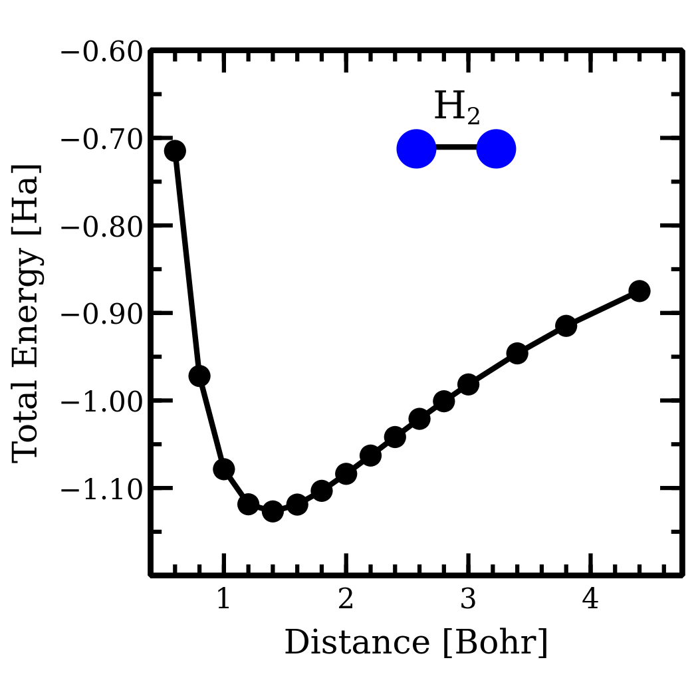

# LearnHatreeFock.jl
 
      

## Learning Hatree-Fock By Doing

This package is focused on learning how to code a package for solving simple Hatree-Fock electronic structure calculations. 

The aim is to assist users of mainstream quantum chemistry and electronic structure software (e.g. NWChem, CP2K) with a more fundamental understanding of the steps associated with with all-electron wavefunction based approaches. This code will only address  Hatree-Fock approach (i.e. only electron exchange) using simple Gaussian basis-set (e.g. 6-31G). The code relies heavily on Gaussian product theorem to handle integrals. 

The code here is directly based on the implementation the video series and matlab code by [Prof. James Johns at the Univ. of Minnesota](http://www1.chem.umn.edu/groups/johns/index.html). This version is written in [Julia](https://julialang.org/), which will have familiar syntax as Matlab, but may have promising performance advantages and uses a liberal MIT license.

## What Code Can & Cannot Do
### Does
    1. Spherical Gaussian basis-sets. Relies on Gaussian product theorem exhaustively.
    2. Mean-field Hatree-Fock approach 
       a. Self-consistent Field solution
    3. Minimum Energy in Hatree units.
### Doesn't
    1. Non-Gaussian basis-sets.
    2. Gaussian basis-sets including angular, polarized, or diffuse functions.
    3. Electron correlation energy.
    4. Excited-state, dynamics, or perturbation theory calculations.

### H2 Binding Curve Example

## Folder Hierarchy
  - /src - The primary source code for running HatreeFock.jl
  - /tests - Test modules for comparing to original code by Prof. James John.
  - /docs - Documentation.
  - /examples  - Example calculations and basis-sets.

